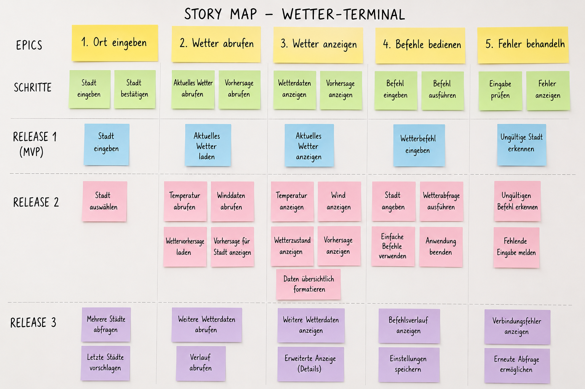
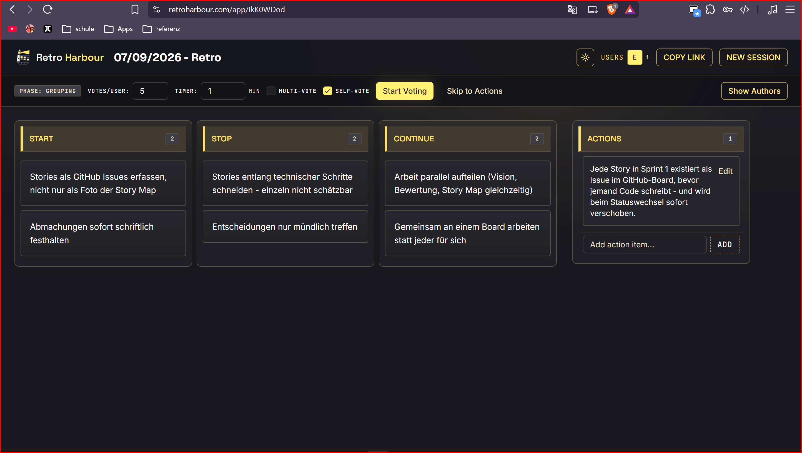

# Scrum-Portfolio – WeatherCLI

Modul 426 · AP25b · Team 5

**Arbeitsstand:** Teamrollen, Vision, fünf verfeinerte Stories, Retro und DoD sind dokumentiert. Lionel hat am 07.09.2026 die DoD, YouTrack als Aufgabenverwaltung und die Erfassung der fünf Stories bestätigt. Die offizielle Portfolio-Vorlage liegt noch nicht vor; der Abgleich damit bleibt offen. Die übrige Sprint-0-Dokumentation wird wie im Auftrag vorgesehen an Modultag 5 vervollständigt.

## 1. Team und Produkt

**Team:** Team 5, AP25b: Lionel, Nico, Eduart und Fidan. Rollenverteilung gemäss Teamangabe:

| Verantwortungsbereich | Teammitglied |
| --- | --- |
| Product Owner | Eduart |
| Scrum Master | Fidan |
| Developers | Lionel und Nico |

**Produkt:** WeatherCLI ist eine Kommandozeilen-Anwendung für Wetterinformationen zu einer Stadt. Personen, die häufig im Terminal arbeiten, erhalten die Informationen direkt in ihrer Arbeitsumgebung.

**Repository:** [m426-ap25b-team5-weathercli](https://github.com/lionel0021/m426-ap25b-team5-weathercli)

**Sprint-1-Zielvorschlag:** Eine Person kann für eine Stadt aktuelles Wetter im Terminal abrufen und erhält bei ungültiger Eingabe eine verständliche Rückmeldung. Der endgültige Umfang wird im Planning anhand der Schätzungen festgelegt.

## 2. Product Vision

> Schnellen und einfachen Zugriff auf aktuelle Wetterdaten und Vorhersagen direkt im Terminal ermöglichen.

Die Zielgruppe umfasst Terminalnutzerinnen und Terminalnutzer, insbesondere Entwicklerinnen und Entwickler sowie Personen, die schnell Wetterinformationen benötigen. Der Nutzen liegt im direkten Zugriff ohne Wechsel zu einer Website oder weiteren App. Das Produkt bietet eine textbasierte Wetterabfrage für eine Stadt mit klaren Befehlen und übersichtlicher Ausgabe. Vorhersagen gehören zur langfristigen Vision; sie sind im vorgeschlagenen Sprint-1-Umfang noch nicht enthalten.

Die dokumentierten Projektziele sind: Projektanforderungen erfüllen, Scrum-Zusammenarbeit üben, wartbaren Code entwickeln und das Projekt termingerecht abschliessen.

**Originalnachweis:** [Product Vision – WeatherCLI](../doc/Product%20Vision%20%E2%80%93%20WeatherCLI.png)

**Vorhandene Reflexion:** [Bewertung der Product Vision](../doc/ki-bewertung.md). Darin sind unter anderem präzisere Zielgruppen und messbare Projektziele als Verbesserung genannt.

## 3. Product Backlog

**Story Map aus Auftrag 3.1:** [Originalbild](../doc/StoryBoard.png)

**Verfeinerte Einträge:** [Product Backlog mit fünf ausgearbeiteten Stories](product-backlog.md)

**Aufgabenverwaltung:** [WeatherCLI in YouTrack](https://weathercli.youtrack.cloud/). Die fünf Stories sind gemäss Rückmeldung von Lionel am 07.09.2026 dort erfasst. Eine unabhängige Prüfung der Board-Einträge fand nicht statt; im Portfolio ist wie gewünscht nur der YouTrack-Link hinterlegt.

**Priorisierungsmethode für das vorgeschlagene Backlog:** MoSCoW, innerhalb einer Kategorie nach unmittelbarem Nutzwert und Abhängigkeiten geordnet. Must liefert eine vollständige aktuelle Wetterabfrage. Should ergänzt Wind, mehrteilige Ortsnamen und Hilfe. Could umfasst spätere Komfortfunktionen. Die technische Basis wird innerhalb einer nutzbaren Story umgesetzt.

| Rang | Story | Priorität | Begründung |
| --- | --- | --- | --- |
| 1 | US-01: Aktuelle Temperatur für eine Stadt | Must | Erster vollständig benutzbarer Wetteraufruf |
| 2 | US-02: Aktuellen Wetterzustand erkennen | Must | Ergänzt entscheidende Information für einen Weg im Freien |
| 3 | US-03: Aktuelle Windgeschwindigkeit | Should | Hilft bei der Einschätzung einer Velofahrt |
| 4 | US-04: Mehrteilige Stadtnamen | Should | Macht die Abfrage für weitere Reiseziele nutzbar |
| 5 | US-05: Hilfe und unbekannte Optionen | Should | Ermöglicht Einstieg ohne externe Anleitung |

Die ursprünglichen technischen Teilschritte der Map wurden in sichtbare Nutzerergebnisse zusammengeführt. Jede der fünf Stories hat Rolle, Nutzen und zwei bis vier beobachtbare Akzeptanzkriterien einschliesslich eines Fehlerfalls. Schätzungen und Sprint-Auswahl sind noch offen; die Reihenfolge ist im Planning mit dem Team abzugleichen.

## 4. Sprint-Dokumentation

### Sprint 0 – Produktgrundlage und Zusammenarbeit

**Ziel:** Vision und Backlog vorbereiten und gemeinsame Arbeitsregeln für Sprint 1 festlegen.

**Vorhandene Nachweise:** Product Vision, deren Bewertung, Story Map und Retro-Screenshot sind im Repository abgelegt und verlinkt. Die fünf Stories sind schriftlich ausgearbeitet, die DoD ist gemäss Teamrückmeldung bestätigt.

#### Retrospective

**Nachweis:** Retro Harbour, 07.09.2026. Der bereitgestellte Screenshot enthält die Erkenntnisse unter Start, Stop und Continue sowie eine Massnahme unter Actions.

[Screenshot der Sprint-0-Retrospective](../doc/retrospective-sprint0.png)

- **Was hat funktioniert (Continue)?** Die Arbeit parallel aufteilen: Vision, Bewertung und Story Map konnten gleichzeitig bearbeitet werden. Gemeinsam an einem Board arbeiten, statt dass jede Person für sich arbeitet.
- **Was hat gebremst (Stop)?** Stories entlang technischer Schritte schneiden: Die einzelnen Teile waren nicht schätzbar. Entscheidungen nur mündlich treffen.
- **Was soll beginnen (Start)?** Stories als Issues erfassen, statt sie nur als Foto der Story Map abzulegen. Abmachungen sofort schriftlich festhalten.

**Genau eine Verbesserungsmassnahme für Sprint 1 – aus der Actions-Karte, auf das bestätigte Team-Board angepasst:**

> Jede Story in Sprint 1 existiert als Issue im YouTrack-Board, bevor jemand Code schreibt – und wird beim Statuswechsel sofort verschoben.

**Bezug zum Originalnachweis:** Der Screenshot nennt noch GitHub. Gemäss Bestätigung von Lionel am 07.09.2026 wird die Massnahme mit [YouTrack](https://weathercli.youtrack.cloud/) umgesetzt. Der Original-Screenshot bleibt unverändert.

**Prüfung an Modultag 6:** Für jede bis dahin begonnene Sprint-1-Story prüfen, ob das Issue vor dem ersten zugehörigen Code-Commit angelegt wurde und ob die Statushistorie die tatsächlichen Arbeitswechsel zeitnah abbildet. Issue-Link und Prüfergebnis hier festhalten. Vorgeschlagene Zuständigkeit für die Prüfung: Fidan als Scrum Master.

| Story / Issue-Link | Issue vor erstem Code-Commit angelegt | Statuswechsel sofort dokumentiert | Prüfergebnis an Modultag 6 |
| --- | --- | --- | --- |
| Bei Prüfung ergänzen | offen | offen | offen |

#### Definition of Done

[Schriftliche DoD mit sechs prüfbaren Kriterien](definition-of-done.md). Für Sprint 1 gemäss Rückmeldung von Lionel am 07.09.2026 bestätigt; Überprüfung an Modultag 5 vorgesehen.

#### An Modultag 5 vervollständigen

- Tatsächliche Sprint-0-Ergebnisse und gegebenenfalls Review-Rückmeldungen ergänzen.
- DoD gemeinsam prüfen und Änderungen dokumentieren.
- Übrige Felder des Sprint-0-Blocks anhand der offiziellen Portfolio-Vorlage ergänzen.

## 5. Nachweise und offene Abschlussarbeiten

| Anforderung aus Auftrag 4.1 | Stand / Nachweis |
| --- | --- |
| Fünf Stories mit Rolle, Nutzen und 2–4 prüfbaren Kriterien | In [product-backlog.md](product-backlog.md) vorbereitet |
| Keine der fünf Stories ist ein Epic | Enger Umfang beschrieben; Team-Schätzung auf höchstens zwei Modultage ausstehend |
| Fünf Stories im Board | Erfassung in YouTrack durch Lionel bestätigt; nicht unabhängig geprüft |
| Eine nachprüfbare Verbesserungsmassnahme | Im Sprint-0-Block mit Prüfung an Modultag 6 dokumentiert; YouTrack als Board bestätigt; Retro-Screenshot verlinkt |
| DoD mit 4–6 Kriterien schriftlich abgelegt | [Sechs Kriterien](definition-of-done.md); für Sprint 1 bestätigt |
| Portfolio Abschnitte 1–3 gefüllt | Team mit Rollen, Produkt, Vision, Backlog und YouTrack-Link erfasst |
| Offizielle Portfolio-Vorlage übernommen | Offen: Vorlage/Modulrepo bislang nicht verfügbar; vorliegende Gliederung folgt dem Auftrag |
| Story-Map-Bild verlinkt | In Abschnitt 3 enthalten |
